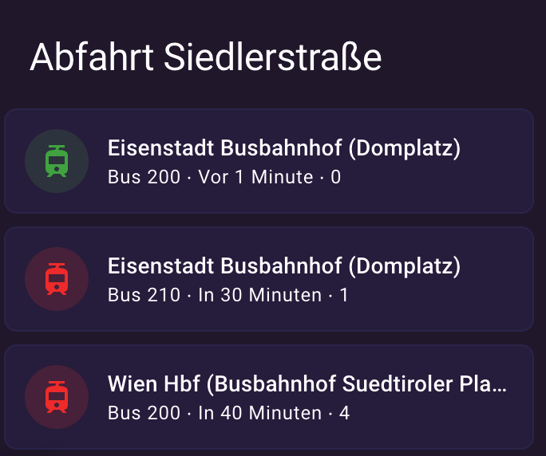

# Get information about next departures

A sensor platform which allows you to get information about departures from a specified OEBB stop.


## Example configuration.yaml

```yaml
sensor:
  - platform: oebb
    L: vs_scotty.vs_liveticker
    evaId: 317040
    productsFilter: 1011111111011
```

## Configuration variables

key | description | default value
-- | -- | --
**platform (Required)** | The platform name. 
**evaID (Required)** | OEBB departure station ID | default=None
**L (Optional)**| ? | default="vs_liveticker"
**dirInput (Optional)** | OEBB destination station ID - filter journey stopping there | default=""
**boardType (Optional)** | **dep** or **arr** for departure or arrival respectively | default="dep"
**tickerID (Optional)** | ? | default="dep"
**start (Optional)** | ? | default="yes"
**eqstop (Optional)** | ? | default="false"
**showJourneys (Optional)** | number of journeys to retreive | default=12
**additionalTime (Optional)** | add lead time (minutes) / offset to query next journeys | default=""
**productsFilter (Optional)** | filter the means of transportation. | default=1011111111011

### productsFilter Options

value | transportation type
-- | --
**0000000000001** | RGJ
**0000000000010** | ?
**0000000000100** | BUS Regional?
**0000000001000** | Tram
**0000000010000** | U-Bahn
**0000000100000** | ?
**0000001000000** | BUS Kurzstrecke
**0000010000000** | S-Bahn
**0000100000000** | REX
**0001000000000** | Nightjet / D / EN (Ausland)
**0010000000000** | IC / EC
**0100000000000** | ?
**1000000000000** | RJ / RJX

Example: productsFilter=1111110111011 → Show all means of transportation except buses

## ÖBB Source
You may get all options for your Integration from here:
1. Goto: [ÖBB Scotty](https://fahrplan.oebb.at/bin/stboard.exe/en?protocol=https:&)
2. Enter Depature Station
3. Open Table in new Popup-window
4. Analyze the URL Parameters (example):

https://fahrplan.oebb.at/bin/stboard.exe/en?L=vs_scotty.vs_liveticker&evaId=317040&boardType=dep&productsFilter=1011111111011&dirInput=&tickerID=dep&start=yes&eqstops=false&showJourneys=12&additionalTime=0


## Sample overview



### Tile card example
you will need custom frontend plugins "[auto-entities](https://github.com/thomasloven/lovelace-auto-entities)" and "[config-template-card](https://github.com/iantrich/config-template-card)" for this:

```yaml
type: custom:auto-entities
card:
  square: false
  type: grid
  title: Abfahrt Siedlerstraße
  columns: 1
card_param: cards
filter:
  include:
    - entity_id: sensor.oebb_journey_*
      options:
        type: custom:config-template-card
        variables:
          _state: states['this.entity_id'].state
          _startTime: states['this.entity_id'].attributes.startTime
          _lastStop: states['this.entity_id'].attributes.lastStop
          _line: states['this.entity_id'].attributes.line
          _status: states['this.entity_id'].attributes.status
          _delay: states['this.entity_id'].attributes.delay
        entities:
          - this.entaity_id
        card:
          type: tile
          entity: this.entity_id
          name: ${_lastStop}
          color: '${_delay > ''0'' ? ''red'' : ''green''}'
          state_content:
            - line
            - state
            - delay
  exclude:
    - state: unavailable
    - attributes:
        line: Bus 221
    - attributes:
        line: S 60
sort:
  method: state
  count: 15
```

## Notes

To retreive the parameters please vitit the website, choose your stop and check the iframe url:
https://fahrplan.oebb.at/bin/stboard.exe/
Additional info on the parameters can also be found on the getStationBoardDataOptions() docu in the mymro repo - Thanks!

Sources: 
https://github.com/mymro/oebb-api

This platform is using the [OEBB API]([https://fahrplan.oebb.at/bin/stboard.exe/]) API to get the information.

